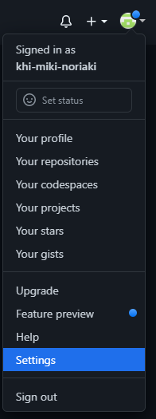
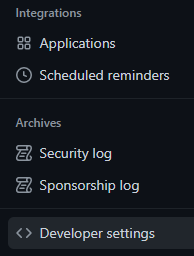
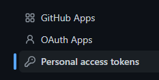
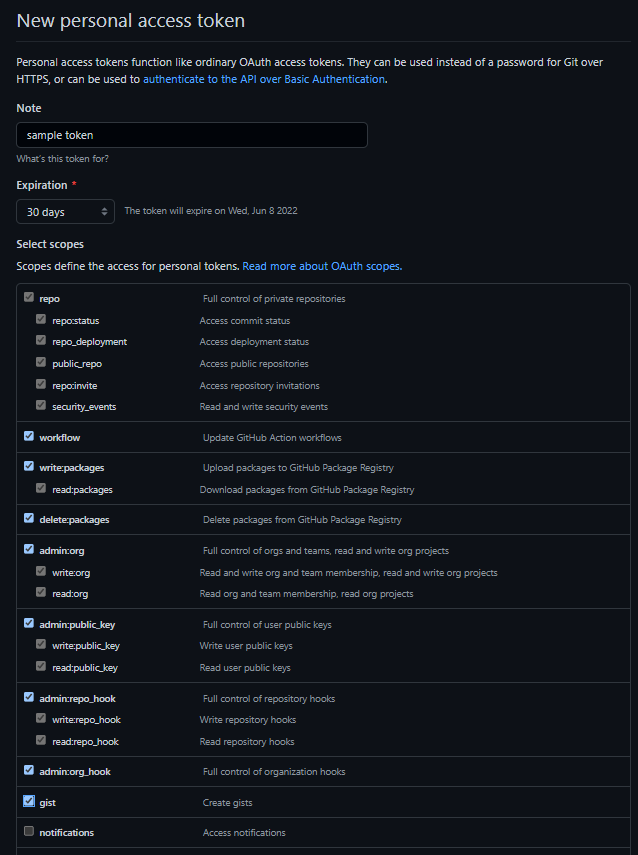
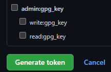
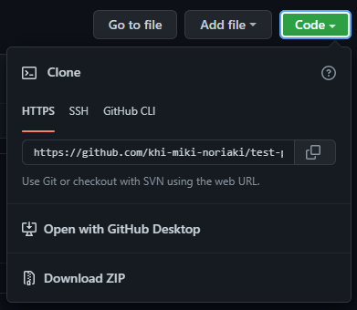

# Git 操作に関するメモ

以下の環境で実施

* Windows 10 Pro 21H2
* git for windows version 2.35.2.windows.1
* Proxy 認証有

## 2要素認証ありで Private repository の https clone 手順

* `git config` に Proxy の設定を追加

```sh
> git config --global http.proxy "http://<proxy user>:<proxy pass>@<proxy url>:<port>"
```

* 2要素認証の場合、アクセストークンが(多分)必要なので作成する<br>
  Github のアカウントにログインし、右上のアイコンから `Settings` を選択

  

* 左のメニューにある `Developper settings` を選択

  

* 左のメニューにある `Personal access tokens` を選択

  

* 右側の `Generate new token` をクリック

  

* アクセストークの設定を行う<br>
  `Note` にはアクセストークンの説明を記述<br>
  `Expiration` はトークンの有効期限<br>
  `Select scopes` は `repo` から `gist` までを選択

  

* `Generate token` をクリックしてトークンを作成

  

* トークンが表示されるのでコピーする(二度と表示されない)

  

* Github から clone するリポジトリの URL をコピーする

  

* コピーした URL にユーザ名を追加する

  ```txt
  https://khi-miki-noriaki@github.com/khi-miki-noriaki/test-private.git
  ```

* `git clone` コマンドでクローンする.

  ```sh
  > git clone https://khi-miki-noriaki@github.com/khi-miki-noriaki/test-private.git
  ```

* 認証情報を求められるので、作成したトークンを入力する

## SSH 接続の Clone 手順(失敗)

ssh で行いたいのだが、Proxy 環境下ではうまくいかなかった...

やったことをメモとして残しておく

参考サイト: [大学のプロキシに通してgithub(とssh)を使う](https://qwerty.hateblo.jp/entry/2018/07/07/171205)

* 以下の設定を `~/.ssh/config` に設定

  ```conf
  Host github.com.khi
      HostName github.com
      ProxyCommand "C:\Program Files\Git\mingw64\bin\connect.exe" -H <proxy user>@<proxy url>:<port> %h %p
      User git
      Port 22
      IdentityFile ~/.ssh/github-khi
      TCPKeepAlive yes
      IdentitiesOnly yes
  ```

* 以下のコマンドをコマンドプロンプトで入力

  ```sh
  > ssh -T git@github.com.khi
  ```

* 何のメッセージも表示されずに終了...
